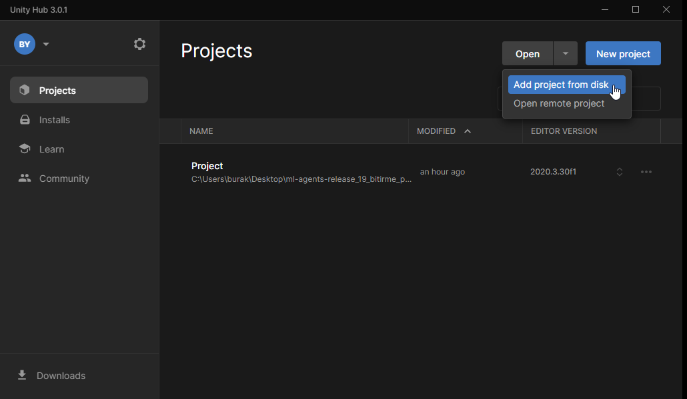
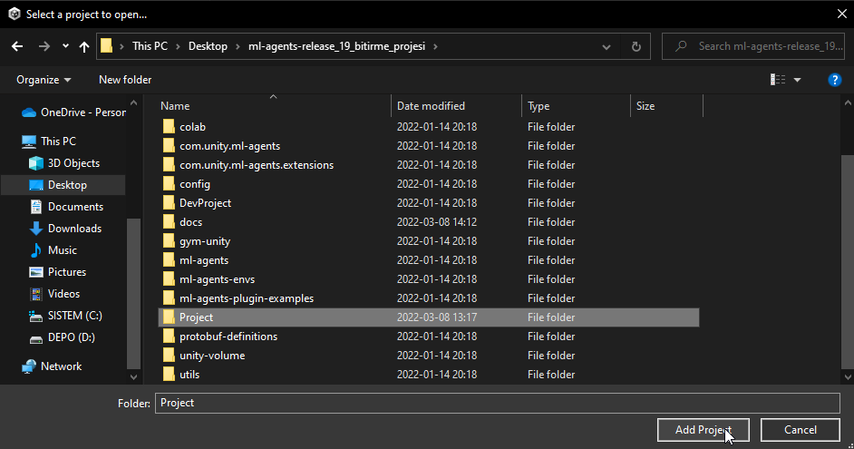

# [Bitirme Projesi] - Package Delivery System Using Artificial Intelligence and Reinforcement Learning

[](https://github.com/Unity-Technologies/ml-agents/tree/release_12_docs/docs/)

[](LICENSE)

## Versiyonlar

-   **Project Github:** Projeyi indirmek icin asagidaki komut cmd'de calistirilir.

    ```sh
    git clone
    ```

-   **Unity ML-Agents Toolkit : release_12** (`ml-agents-release_12` reposunun [release_12/README.md](https://github.com/Unity-Technologies/ml-agents/tree/release_12_branch) dosyasina buradan ulasilabilir.

    ```sh
    git clone --branch release_12 https://github.com/Unity-Technologies/ml-agents.git
    ```

-   **Unity 2022.2.1f1 (64-bit)**
    [Download Link](https://unity.com/)

-   **Python 3.7.9 Windows x86-64 executable installer**
    [Download Link](https://www.python.org/ftp/python/3.7.9/python-3.7.9-amd64.exe)

-   **PyTorch : 1.7.0**

    ```sh
    pip3 install torch==1.7.0 -f https://download.pytorch.org/whl/torch_stable.html
    ```

-   **Unity package : 1.7.2** Unity ML-Agents Toolkit : release_12 ile esdegerdir.

-   **Python package mlagents : 0.23.0**

    ```sh
    python -m pip install mlagents==0.23.0
    ```

-   **mbaske/angry-ai**
    ```sh
    https://github.com/mbaske/angry-ai
    ```

## Projenin Unity'de acilmasi

Unity Hub'a girildikten sonra `Open > Add project from disk` butonundan [Project Klasoru](Project/) secilir.





Unity ML-Agents'in proje icerinde calisabilmesi icin lazim olan tum package'lar ve proje'nin asset dosyalari yuklenmistir, calismaya hazir durumdadir.
